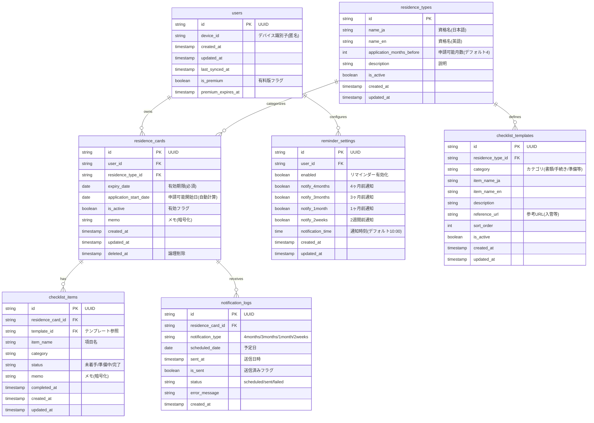

# データベース設計書：在留資格更新リマインダー

**作成日**: 2026年2月14日
**バージョン**: 1.0

---

## 1. 概要

本設計書は、在留資格更新リマインダーアプリのデータベース設計を定義します。

### 1.1 設計方針
- **MVP フェーズ**: ローカルストレージ（SQLite）を使用
- **将来拡張**: クラウド同期対応（PostgreSQL）を考慮
- **データ最小化**: 個人を特定できる情報は保存しない
- **セキュリティ**: 機密データは暗号化して保存
- **オフライン対応**: ローカル優先のデータ管理

---

## 2. ER図



---

## 3. テーブル定義

### 3.1 users（ユーザー）

**目的**: デバイス単位のユーザー管理（匿名化）

| カラム名 | 型 | NULL | デフォルト | 説明 |
|---------|-----|------|-----------|------|
| id | VARCHAR(36) | NOT NULL | UUID | 主キー |
| device_id | VARCHAR(255) | NULL | - | デバイス識別子（匿名） |
| created_at | TIMESTAMP | NOT NULL | CURRENT_TIMESTAMP | 作成日時 |
| updated_at | TIMESTAMP | NOT NULL | CURRENT_TIMESTAMP | 更新日時 |
| last_synced_at | TIMESTAMP | NULL | - | 最終同期日時 |
| is_premium | BOOLEAN | NOT NULL | FALSE | 有料版フラグ |
| premium_expires_at | TIMESTAMP | NULL | - | 有料版期限 |

**インデックス**:
- PRIMARY KEY (id)
- UNIQUE INDEX idx_device_id (device_id)
- INDEX idx_premium (is_premium, premium_expires_at)

---

### 3.2 residence_types（在留資格マスタ）

**目的**: 在留資格タイプの定義（マスタデータ）

| カラム名 | 型 | NULL | デフォルト | 説明 |
|---------|-----|------|-----------|------|
| id | VARCHAR(50) | NOT NULL | - | 主キー（例: work_visa, spouse, permanent_resident） |
| name_ja | VARCHAR(255) | NOT NULL | - | 資格名（日本語） |
| name_en | VARCHAR(255) | NULL | - | 資格名（英語） |
| application_months_before | INTEGER | NOT NULL | 4 | 申請可能月数前 |
| description | TEXT | NULL | - | 説明 |
| is_active | BOOLEAN | NOT NULL | TRUE | 有効フラグ |
| created_at | TIMESTAMP | NOT NULL | CURRENT_TIMESTAMP | 作成日時 |
| updated_at | TIMESTAMP | NOT NULL | CURRENT_TIMESTAMP | 更新日時 |

**インデックス**:
- PRIMARY KEY (id)
- INDEX idx_active (is_active)

**初期データ例**:
```sql
INSERT INTO residence_types (id, name_ja, name_en, application_months_before) VALUES
('work_visa', '技術・人文知識・国際業務', 'Engineer/Specialist in Humanities/International Services', 4),
('spouse_japanese', '日本人の配偶者等', 'Spouse or Child of Japanese National', 4),
('spouse_permanent', '永住者の配偶者等', 'Spouse or Child of Permanent Resident', 4),
('permanent_application', '永住申請準備', 'Permanent Residence Application Prep', 6),
('other', 'その他', 'Other', 4);
```

---

### 3.3 residence_cards（在留カード情報）

**目的**: ユーザーが登録した在留資格情報

| カラム名 | 型 | NULL | デフォルト | 説明 |
|---------|-----|------|-----------|------|
| id | VARCHAR(36) | NOT NULL | UUID | 主キー |
| user_id | VARCHAR(36) | NOT NULL | - | ユーザーID（外部キー） |
| residence_type_id | VARCHAR(50) | NOT NULL | - | 資格タイプID（外部キー） |
| expiry_date | DATE | NOT NULL | - | 有効期限（必須） |
| application_start_date | DATE | NULL | - | 申請可能開始日（自動計算） |
| is_active | BOOLEAN | NOT NULL | TRUE | 有効フラグ |
| memo | TEXT | NULL | - | メモ（暗号化推奨） |
| created_at | TIMESTAMP | NOT NULL | CURRENT_TIMESTAMP | 作成日時 |
| updated_at | TIMESTAMP | NOT NULL | CURRENT_TIMESTAMP | 更新日時 |
| deleted_at | TIMESTAMP | NULL | - | 論理削除日時 |

**インデックス**:
- PRIMARY KEY (id)
- INDEX idx_user (user_id, is_active)
- INDEX idx_expiry (expiry_date)
- INDEX idx_deleted (deleted_at)

**制約**:
- FOREIGN KEY (user_id) REFERENCES users(id) ON DELETE CASCADE
- FOREIGN KEY (residence_type_id) REFERENCES residence_types(id)

---

### 3.4 checklist_templates（チェックリストテンプレート）

**目的**: 資格タイプごとの必要書類・手続きテンプレート

| カラム名 | 型 | NULL | デフォルト | 説明 |
|---------|-----|------|-----------|------|
| id | VARCHAR(36) | NOT NULL | UUID | 主キー |
| residence_type_id | VARCHAR(50) | NOT NULL | - | 資格タイプID（外部キー） |
| category | VARCHAR(50) | NOT NULL | - | カテゴリ（書類/手続き/準備） |
| item_name_ja | VARCHAR(255) | NOT NULL | - | 項目名（日本語） |
| item_name_en | VARCHAR(255) | NULL | - | 項目名（英語） |
| description | TEXT | NULL | - | 説明 |
| reference_url | TEXT | NULL | - | 参考URL |
| sort_order | INTEGER | NOT NULL | 0 | 表示順 |
| is_active | BOOLEAN | NOT NULL | TRUE | 有効フラグ |
| created_at | TIMESTAMP | NOT NULL | CURRENT_TIMESTAMP | 作成日時 |
| updated_at | TIMESTAMP | NOT NULL | CURRENT_TIMESTAMP | 更新日時 |

**インデックス**:
- PRIMARY KEY (id)
- INDEX idx_residence_type (residence_type_id, is_active, sort_order)
- INDEX idx_category (category)

**制約**:
- FOREIGN KEY (residence_type_id) REFERENCES residence_types(id)

**初期データ例**:
```sql
-- 技術・人文知識・国際業務向けチェックリスト
INSERT INTO checklist_templates (id, residence_type_id, category, item_name_ja, sort_order) VALUES
(UUID(), 'work_visa', '基本書類', '在留期間更新許可申請書', 1),
(UUID(), 'work_visa', '基本書類', '写真（4cm × 3cm）', 2),
(UUID(), 'work_visa', '基本書類', '在留カード（原本）', 3),
(UUID(), 'work_visa', '証明書類', '在職証明書', 4),
(UUID(), 'work_visa', '証明書類', '課税証明書・納税証明書', 5),
(UUID(), 'work_visa', '会社書類', '会社登記簿謄本', 6);
```

---

### 3.5 checklist_items（チェックリスト項目）

**目的**: ユーザーごとのチェックリスト進捗管理

| カラム名 | 型 | NULL | デフォルト | 説明 |
|---------|-----|------|-----------|------|
| id | VARCHAR(36) | NOT NULL | UUID | 主キー |
| residence_card_id | VARCHAR(36) | NOT NULL | - | 在留カードID（外部キー） |
| template_id | VARCHAR(36) | NULL | - | テンプレートID（参照用） |
| item_name | VARCHAR(255) | NOT NULL | - | 項目名 |
| category | VARCHAR(50) | NOT NULL | - | カテゴリ |
| status | VARCHAR(20) | NOT NULL | 'pending' | ステータス（pending/in_progress/completed） |
| memo | TEXT | NULL | - | メモ（暗号化推奨） |
| completed_at | TIMESTAMP | NULL | - | 完了日時 |
| created_at | TIMESTAMP | NOT NULL | CURRENT_TIMESTAMP | 作成日時 |
| updated_at | TIMESTAMP | NOT NULL | CURRENT_TIMESTAMP | 更新日時 |

**インデックス**:
- PRIMARY KEY (id)
- INDEX idx_residence_card (residence_card_id, status)
- INDEX idx_template (template_id)

**制約**:
- FOREIGN KEY (residence_card_id) REFERENCES residence_cards(id) ON DELETE CASCADE
- FOREIGN KEY (template_id) REFERENCES checklist_templates(id) ON DELETE SET NULL

---

### 3.6 reminder_settings（リマインダー設定）

**目的**: ユーザーごとの通知設定

| カラム名 | 型 | NULL | デフォルト | 説明 |
|---------|-----|------|-----------|------|
| id | VARCHAR(36) | NOT NULL | UUID | 主キー |
| user_id | VARCHAR(36) | NOT NULL | - | ユーザーID（外部キー） |
| enabled | BOOLEAN | NOT NULL | TRUE | リマインダー有効化 |
| notify_4months | BOOLEAN | NOT NULL | TRUE | 4ヶ月前通知 |
| notify_3months | BOOLEAN | NOT NULL | TRUE | 3ヶ月前通知 |
| notify_1month | BOOLEAN | NOT NULL | TRUE | 1ヶ月前通知 |
| notify_2weeks | BOOLEAN | NOT NULL | TRUE | 2週間前通知 |
| notification_time | TIME | NOT NULL | '10:00:00' | 通知時刻 |
| created_at | TIMESTAMP | NOT NULL | CURRENT_TIMESTAMP | 作成日時 |
| updated_at | TIMESTAMP | NOT NULL | CURRENT_TIMESTAMP | 更新日時 |

**インデックス**:
- PRIMARY KEY (id)
- UNIQUE INDEX idx_user (user_id)

**制約**:
- FOREIGN KEY (user_id) REFERENCES users(id) ON DELETE CASCADE

---

### 3.7 notification_logs（通知履歴）

**目的**: 通知スケジュール・送信履歴の管理

| カラム名 | 型 | NULL | デフォルト | 説明 |
|---------|-----|------|-----------|------|
| id | VARCHAR(36) | NOT NULL | UUID | 主キー |
| residence_card_id | VARCHAR(36) | NOT NULL | - | 在留カードID（外部キー） |
| notification_type | VARCHAR(20) | NOT NULL | - | 通知タイプ（4months/3months/1month/2weeks） |
| scheduled_date | DATE | NOT NULL | - | 予定日 |
| sent_at | TIMESTAMP | NULL | - | 送信日時 |
| is_sent | BOOLEAN | NOT NULL | FALSE | 送信済みフラグ |
| status | VARCHAR(20) | NOT NULL | 'scheduled' | ステータス（scheduled/sent/failed） |
| error_message | TEXT | NULL | - | エラーメッセージ |
| created_at | TIMESTAMP | NOT NULL | CURRENT_TIMESTAMP | 作成日時 |

**インデックス**:
- PRIMARY KEY (id)
- INDEX idx_residence_card (residence_card_id, notification_type)
- INDEX idx_scheduled (scheduled_date, is_sent)
- INDEX idx_status (status, scheduled_date)

**制約**:
- FOREIGN KEY (residence_card_id) REFERENCES residence_cards(id) ON DELETE CASCADE

---

## 4. DDL（SQLite版）

### 4.1 テーブル作成スクリプト

```sql
-- users テーブル
CREATE TABLE users (
    id TEXT PRIMARY KEY,
    device_id TEXT UNIQUE,
    created_at DATETIME NOT NULL DEFAULT CURRENT_TIMESTAMP,
    updated_at DATETIME NOT NULL DEFAULT CURRENT_TIMESTAMP,
    last_synced_at DATETIME,
    is_premium INTEGER NOT NULL DEFAULT 0,
    premium_expires_at DATETIME
);

CREATE INDEX idx_users_premium ON users(is_premium, premium_expires_at);

-- residence_types テーブル
CREATE TABLE residence_types (
    id TEXT PRIMARY KEY,
    name_ja TEXT NOT NULL,
    name_en TEXT,
    application_months_before INTEGER NOT NULL DEFAULT 4,
    description TEXT,
    is_active INTEGER NOT NULL DEFAULT 1,
    created_at DATETIME NOT NULL DEFAULT CURRENT_TIMESTAMP,
    updated_at DATETIME NOT NULL DEFAULT CURRENT_TIMESTAMP
);

CREATE INDEX idx_residence_types_active ON residence_types(is_active);

-- residence_cards テーブル
CREATE TABLE residence_cards (
    id TEXT PRIMARY KEY,
    user_id TEXT NOT NULL,
    residence_type_id TEXT NOT NULL,
    expiry_date DATE NOT NULL,
    application_start_date DATE,
    is_active INTEGER NOT NULL DEFAULT 1,
    memo TEXT,
    created_at DATETIME NOT NULL DEFAULT CURRENT_TIMESTAMP,
    updated_at DATETIME NOT NULL DEFAULT CURRENT_TIMESTAMP,
    deleted_at DATETIME,
    FOREIGN KEY (user_id) REFERENCES users(id) ON DELETE CASCADE,
    FOREIGN KEY (residence_type_id) REFERENCES residence_types(id)
);

CREATE INDEX idx_residence_cards_user ON residence_cards(user_id, is_active);
CREATE INDEX idx_residence_cards_expiry ON residence_cards(expiry_date);
CREATE INDEX idx_residence_cards_deleted ON residence_cards(deleted_at);

-- checklist_templates テーブル
CREATE TABLE checklist_templates (
    id TEXT PRIMARY KEY,
    residence_type_id TEXT NOT NULL,
    category TEXT NOT NULL,
    item_name_ja TEXT NOT NULL,
    item_name_en TEXT,
    description TEXT,
    reference_url TEXT,
    sort_order INTEGER NOT NULL DEFAULT 0,
    is_active INTEGER NOT NULL DEFAULT 1,
    created_at DATETIME NOT NULL DEFAULT CURRENT_TIMESTAMP,
    updated_at DATETIME NOT NULL DEFAULT CURRENT_TIMESTAMP,
    FOREIGN KEY (residence_type_id) REFERENCES residence_types(id)
);

CREATE INDEX idx_checklist_templates_residence ON checklist_templates(residence_type_id, is_active, sort_order);
CREATE INDEX idx_checklist_templates_category ON checklist_templates(category);

-- checklist_items テーブル
CREATE TABLE checklist_items (
    id TEXT PRIMARY KEY,
    residence_card_id TEXT NOT NULL,
    template_id TEXT,
    item_name TEXT NOT NULL,
    category TEXT NOT NULL,
    status TEXT NOT NULL DEFAULT 'pending',
    memo TEXT,
    completed_at DATETIME,
    created_at DATETIME NOT NULL DEFAULT CURRENT_TIMESTAMP,
    updated_at DATETIME NOT NULL DEFAULT CURRENT_TIMESTAMP,
    FOREIGN KEY (residence_card_id) REFERENCES residence_cards(id) ON DELETE CASCADE,
    FOREIGN KEY (template_id) REFERENCES checklist_templates(id) ON DELETE SET NULL
);

CREATE INDEX idx_checklist_items_residence ON checklist_items(residence_card_id, status);
CREATE INDEX idx_checklist_items_template ON checklist_items(template_id);

-- reminder_settings テーブル
CREATE TABLE reminder_settings (
    id TEXT PRIMARY KEY,
    user_id TEXT NOT NULL UNIQUE,
    enabled INTEGER NOT NULL DEFAULT 1,
    notify_4months INTEGER NOT NULL DEFAULT 1,
    notify_3months INTEGER NOT NULL DEFAULT 1,
    notify_1month INTEGER NOT NULL DEFAULT 1,
    notify_2weeks INTEGER NOT NULL DEFAULT 1,
    notification_time TEXT NOT NULL DEFAULT '10:00:00',
    created_at DATETIME NOT NULL DEFAULT CURRENT_TIMESTAMP,
    updated_at DATETIME NOT NULL DEFAULT CURRENT_TIMESTAMP,
    FOREIGN KEY (user_id) REFERENCES users(id) ON DELETE CASCADE
);

CREATE UNIQUE INDEX idx_reminder_settings_user ON reminder_settings(user_id);

-- notification_logs テーブル
CREATE TABLE notification_logs (
    id TEXT PRIMARY KEY,
    residence_card_id TEXT NOT NULL,
    notification_type TEXT NOT NULL,
    scheduled_date DATE NOT NULL,
    sent_at DATETIME,
    is_sent INTEGER NOT NULL DEFAULT 0,
    status TEXT NOT NULL DEFAULT 'scheduled',
    error_message TEXT,
    created_at DATETIME NOT NULL DEFAULT CURRENT_TIMESTAMP,
    FOREIGN KEY (residence_card_id) REFERENCES residence_cards(id) ON DELETE CASCADE
);

CREATE INDEX idx_notification_logs_residence ON notification_logs(residence_card_id, notification_type);
CREATE INDEX idx_notification_logs_scheduled ON notification_logs(scheduled_date, is_sent);
CREATE INDEX idx_notification_logs_status ON notification_logs(status, scheduled_date);

-- トリガー（updated_at自動更新）
CREATE TRIGGER update_users_timestamp
AFTER UPDATE ON users
BEGIN
    UPDATE users SET updated_at = CURRENT_TIMESTAMP WHERE id = NEW.id;
END;

CREATE TRIGGER update_residence_types_timestamp
AFTER UPDATE ON residence_types
BEGIN
    UPDATE residence_types SET updated_at = CURRENT_TIMESTAMP WHERE id = NEW.id;
END;

CREATE TRIGGER update_residence_cards_timestamp
AFTER UPDATE ON residence_cards
BEGIN
    UPDATE residence_cards SET updated_at = CURRENT_TIMESTAMP WHERE id = NEW.id;
END;

CREATE TRIGGER update_checklist_templates_timestamp
AFTER UPDATE ON checklist_templates
BEGIN
    UPDATE checklist_templates SET updated_at = CURRENT_TIMESTAMP WHERE id = NEW.id;
END;

CREATE TRIGGER update_checklist_items_timestamp
AFTER UPDATE ON checklist_items
BEGIN
    UPDATE checklist_items SET updated_at = CURRENT_TIMESTAMP WHERE id = NEW.id;
END;

CREATE TRIGGER update_reminder_settings_timestamp
AFTER UPDATE ON reminder_settings
BEGIN
    UPDATE reminder_settings SET updated_at = CURRENT_TIMESTAMP WHERE id = NEW.id;
END;
```

---

## 5. DDL（PostgreSQL版）

### 5.1 テーブル作成スクリプト

```sql
-- UUID拡張を有効化
CREATE EXTENSION IF NOT EXISTS "uuid-ossp";

-- users テーブル
CREATE TABLE users (
    id UUID PRIMARY KEY DEFAULT uuid_generate_v4(),
    device_id VARCHAR(255) UNIQUE,
    created_at TIMESTAMP NOT NULL DEFAULT CURRENT_TIMESTAMP,
    updated_at TIMESTAMP NOT NULL DEFAULT CURRENT_TIMESTAMP,
    last_synced_at TIMESTAMP,
    is_premium BOOLEAN NOT NULL DEFAULT FALSE,
    premium_expires_at TIMESTAMP
);

CREATE INDEX idx_users_premium ON users(is_premium, premium_expires_at);

-- residence_types テーブル
CREATE TABLE residence_types (
    id VARCHAR(50) PRIMARY KEY,
    name_ja VARCHAR(255) NOT NULL,
    name_en VARCHAR(255),
    application_months_before INTEGER NOT NULL DEFAULT 4,
    description TEXT,
    is_active BOOLEAN NOT NULL DEFAULT TRUE,
    created_at TIMESTAMP NOT NULL DEFAULT CURRENT_TIMESTAMP,
    updated_at TIMESTAMP NOT NULL DEFAULT CURRENT_TIMESTAMP
);

CREATE INDEX idx_residence_types_active ON residence_types(is_active);

-- residence_cards テーブル
CREATE TABLE residence_cards (
    id UUID PRIMARY KEY DEFAULT uuid_generate_v4(),
    user_id UUID NOT NULL,
    residence_type_id VARCHAR(50) NOT NULL,
    expiry_date DATE NOT NULL,
    application_start_date DATE,
    is_active BOOLEAN NOT NULL DEFAULT TRUE,
    memo TEXT,
    created_at TIMESTAMP NOT NULL DEFAULT CURRENT_TIMESTAMP,
    updated_at TIMESTAMP NOT NULL DEFAULT CURRENT_TIMESTAMP,
    deleted_at TIMESTAMP,
    FOREIGN KEY (user_id) REFERENCES users(id) ON DELETE CASCADE,
    FOREIGN KEY (residence_type_id) REFERENCES residence_types(id)
);

CREATE INDEX idx_residence_cards_user ON residence_cards(user_id, is_active);
CREATE INDEX idx_residence_cards_expiry ON residence_cards(expiry_date);
CREATE INDEX idx_residence_cards_deleted ON residence_cards(deleted_at);

-- checklist_templates テーブル
CREATE TABLE checklist_templates (
    id UUID PRIMARY KEY DEFAULT uuid_generate_v4(),
    residence_type_id VARCHAR(50) NOT NULL,
    category VARCHAR(50) NOT NULL,
    item_name_ja VARCHAR(255) NOT NULL,
    item_name_en VARCHAR(255),
    description TEXT,
    reference_url TEXT,
    sort_order INTEGER NOT NULL DEFAULT 0,
    is_active BOOLEAN NOT NULL DEFAULT TRUE,
    created_at TIMESTAMP NOT NULL DEFAULT CURRENT_TIMESTAMP,
    updated_at TIMESTAMP NOT NULL DEFAULT CURRENT_TIMESTAMP,
    FOREIGN KEY (residence_type_id) REFERENCES residence_types(id)
);

CREATE INDEX idx_checklist_templates_residence ON checklist_templates(residence_type_id, is_active, sort_order);
CREATE INDEX idx_checklist_templates_category ON checklist_templates(category);

-- checklist_items テーブル
CREATE TABLE checklist_items (
    id UUID PRIMARY KEY DEFAULT uuid_generate_v4(),
    residence_card_id UUID NOT NULL,
    template_id UUID,
    item_name VARCHAR(255) NOT NULL,
    category VARCHAR(50) NOT NULL,
    status VARCHAR(20) NOT NULL DEFAULT 'pending',
    memo TEXT,
    completed_at TIMESTAMP,
    created_at TIMESTAMP NOT NULL DEFAULT CURRENT_TIMESTAMP,
    updated_at TIMESTAMP NOT NULL DEFAULT CURRENT_TIMESTAMP,
    FOREIGN KEY (residence_card_id) REFERENCES residence_cards(id) ON DELETE CASCADE,
    FOREIGN KEY (template_id) REFERENCES checklist_templates(id) ON DELETE SET NULL
);

CREATE INDEX idx_checklist_items_residence ON checklist_items(residence_card_id, status);
CREATE INDEX idx_checklist_items_template ON checklist_items(template_id);

-- reminder_settings テーブル
CREATE TABLE reminder_settings (
    id UUID PRIMARY KEY DEFAULT uuid_generate_v4(),
    user_id UUID NOT NULL UNIQUE,
    enabled BOOLEAN NOT NULL DEFAULT TRUE,
    notify_4months BOOLEAN NOT NULL DEFAULT TRUE,
    notify_3months BOOLEAN NOT NULL DEFAULT TRUE,
    notify_1month BOOLEAN NOT NULL DEFAULT TRUE,
    notify_2weeks BOOLEAN NOT NULL DEFAULT TRUE,
    notification_time TIME NOT NULL DEFAULT '10:00:00',
    created_at TIMESTAMP NOT NULL DEFAULT CURRENT_TIMESTAMP,
    updated_at TIMESTAMP NOT NULL DEFAULT CURRENT_TIMESTAMP,
    FOREIGN KEY (user_id) REFERENCES users(id) ON DELETE CASCADE
);

CREATE UNIQUE INDEX idx_reminder_settings_user ON reminder_settings(user_id);

-- notification_logs テーブル
CREATE TABLE notification_logs (
    id UUID PRIMARY KEY DEFAULT uuid_generate_v4(),
    residence_card_id UUID NOT NULL,
    notification_type VARCHAR(20) NOT NULL,
    scheduled_date DATE NOT NULL,
    sent_at TIMESTAMP,
    is_sent BOOLEAN NOT NULL DEFAULT FALSE,
    status VARCHAR(20) NOT NULL DEFAULT 'scheduled',
    error_message TEXT,
    created_at TIMESTAMP NOT NULL DEFAULT CURRENT_TIMESTAMP,
    FOREIGN KEY (residence_card_id) REFERENCES residence_cards(id) ON DELETE CASCADE
);

CREATE INDEX idx_notification_logs_residence ON notification_logs(residence_card_id, notification_type);
CREATE INDEX idx_notification_logs_scheduled ON notification_logs(scheduled_date, is_sent);
CREATE INDEX idx_notification_logs_status ON notification_logs(status, scheduled_date);

-- updated_at自動更新トリガー関数
CREATE OR REPLACE FUNCTION update_updated_at_column()
RETURNS TRIGGER AS $$
BEGIN
    NEW.updated_at = CURRENT_TIMESTAMP;
    RETURN NEW;
END;
$$ language 'plpgsql';

-- トリガー設定
CREATE TRIGGER update_users_timestamp BEFORE UPDATE ON users
FOR EACH ROW EXECUTE FUNCTION update_updated_at_column();

CREATE TRIGGER update_residence_types_timestamp BEFORE UPDATE ON residence_types
FOR EACH ROW EXECUTE FUNCTION update_updated_at_column();

CREATE TRIGGER update_residence_cards_timestamp BEFORE UPDATE ON residence_cards
FOR EACH ROW EXECUTE FUNCTION update_updated_at_column();

CREATE TRIGGER update_checklist_templates_timestamp BEFORE UPDATE ON checklist_templates
FOR EACH ROW EXECUTE FUNCTION update_updated_at_column();

CREATE TRIGGER update_checklist_items_timestamp BEFORE UPDATE ON checklist_items
FOR EACH ROW EXECUTE FUNCTION update_updated_at_column();

CREATE TRIGGER update_reminder_settings_timestamp BEFORE UPDATE ON reminder_settings
FOR EACH ROW EXECUTE FUNCTION update_updated_at_column();
```

---

## 6. インデックス設計

### 6.1 パフォーマンス最適化

以下のクエリパターンに対するインデックス設計：

1. **有効期限に基づく検索**
   - `idx_residence_cards_expiry` - 期限切れ間近のカード検索

2. **ユーザー別データ取得**
   - `idx_residence_cards_user` - ユーザーの有効なカード一覧
   - `idx_reminder_settings_user` - ユーザーの通知設定

3. **通知スケジュール処理**
   - `idx_notification_logs_scheduled` - 送信予定の通知取得
   - `idx_notification_logs_status` - ステータス別通知管理

4. **チェックリスト取得**
   - `idx_checklist_templates_residence` - 資格タイプ別テンプレート
   - `idx_checklist_items_residence` - カード別チェックリスト

### 6.2 複合インデックスの検討

**将来的に追加を検討すべきインデックス**:
```sql
-- 有効期限と通知設定を組み合わせた高速検索
CREATE INDEX idx_cards_expiry_active ON residence_cards(expiry_date, is_active)
WHERE deleted_at IS NULL;

-- チェックリスト完了率計算の最適化
CREATE INDEX idx_checklist_status_card ON checklist_items(residence_card_id, status);
```

---

## 7. データ暗号化設計

### 7.1 暗号化対象フィールド

- `residence_cards.memo` - ユーザーメモ
- `checklist_items.memo` - チェックリスト項目のメモ

### 7.2 暗号化方式

**推奨**: AES-256-GCM

**実装方法**:
```javascript
// Node.js サンプル
const crypto = require('crypto');

function encrypt(text, key) {
    const iv = crypto.randomBytes(16);
    const cipher = crypto.createCipheriv('aes-256-gcm', Buffer.from(key, 'hex'), iv);
    let encrypted = cipher.update(text, 'utf8', 'hex');
    encrypted += cipher.final('hex');
    const authTag = cipher.getAuthTag();
    return iv.toString('hex') + ':' + authTag.toString('hex') + ':' + encrypted;
}

function decrypt(encryptedData, key) {
    const parts = encryptedData.split(':');
    const iv = Buffer.from(parts[0], 'hex');
    const authTag = Buffer.from(parts[1], 'hex');
    const encrypted = parts[2];
    const decipher = crypto.createDecipheriv('aes-256-gcm', Buffer.from(key, 'hex'), iv);
    decipher.setAuthTag(authTag);
    let decrypted = decipher.update(encrypted, 'hex', 'utf8');
    decrypted += decipher.final('utf8');
    return decrypted;
}
```

### 7.3 暗号化キー管理

- **ローカル**: デバイスのキーチェーン/キーストアに保存
- **クラウド**: AWS KMS、Google Cloud KMS等のキー管理サービス使用

---

## 8. マイグレーション戦略

### 8.1 バージョン管理

マイグレーションツール推奨:
- **Node.js**: `knex.js` or `Sequelize`
- **Python**: `Alembic`
- **Go**: `golang-migrate`

### 8.2 マイグレーション例

```javascript
// knex.js マイグレーション例
exports.up = function(knex) {
    return knex.schema.createTable('users', function(table) {
        table.uuid('id').primary();
        table.string('device_id', 255).unique();
        table.timestamp('created_at').defaultTo(knex.fn.now());
        table.timestamp('updated_at').defaultTo(knex.fn.now());
        table.timestamp('last_synced_at');
        table.boolean('is_premium').defaultTo(false);
        table.timestamp('premium_expires_at');
    });
};

exports.down = function(knex) {
    return knex.schema.dropTable('users');
};
```

---

## 9. データ同期設計

### 9.1 ローカル→クラウド同期戦略

**同期方式**: Last-Write-Wins with Conflict Resolution

```javascript
// 同期ロジック疑似コード
async function syncToCloud(localData) {
    const cloudData = await fetchFromCloud(localData.id);

    if (!cloudData) {
        // クラウドにデータが存在しない場合は新規作成
        await createOnCloud(localData);
    } else if (localData.updated_at > cloudData.updated_at) {
        // ローカルの方が新しい場合は更新
        await updateOnCloud(localData);
    } else if (localData.updated_at < cloudData.updated_at) {
        // クラウドの方が新しい場合はローカルを更新
        await updateLocal(cloudData);
    }
    // 同じタイムスタンプの場合は何もしない
}
```

### 9.2 同期フィールド

- `last_synced_at` - 最終同期日時
- `updated_at` - 最終更新日時（競合検出用）

---

## 10. バックアップ・復元

### 10.1 バックアップ戦略

**ローカルバックアップ**:
- SQLiteファイルの定期コピー
- エクスポート機能（JSON/CSV）

**クラウドバックアップ**:
- PostgreSQLの自動バックアップ（daily）
- Point-in-Time Recovery（PITR）有効化

### 10.2 復元手順

```sql
-- SQLiteバックアップ
.backup backup.db

-- PostgreSQLバックアップ
pg_dump -U username -d database_name > backup.sql

-- PostgreSQL復元
psql -U username -d database_name < backup.sql
```

---

## 11. パフォーマンス考慮事項

### 11.1 想定データ量

- **ユーザー数**: 初期100人 → 1年後10,000人
- **在留カード**: ユーザーあたり平均1.5件
- **チェックリスト項目**: カードあたり平均15件
- **通知ログ**: カードあたり年間4件

### 11.2 クエリ最適化

```sql
-- 期限切れ間近のカード取得（最適化版）
SELECT rc.*, rt.name_ja, rt.application_months_before
FROM residence_cards rc
INNER JOIN residence_types rt ON rc.residence_type_id = rt.id
WHERE rc.is_active = 1
  AND rc.deleted_at IS NULL
  AND rc.expiry_date BETWEEN CURRENT_DATE AND DATE(CURRENT_DATE, '+6 months')
ORDER BY rc.expiry_date ASC;

-- チェックリスト完了率計算
SELECT
    residence_card_id,
    COUNT(*) as total_items,
    SUM(CASE WHEN status = 'completed' THEN 1 ELSE 0 END) as completed_items,
    ROUND(CAST(SUM(CASE WHEN status = 'completed' THEN 1 ELSE 0 END) AS REAL) / COUNT(*) * 100, 2) as completion_rate
FROM checklist_items
GROUP BY residence_card_id;
```

---

## 12. セキュリティチェックリスト

- [ ] SQLインジェクション対策（プリペアドステートメント使用）
- [ ] 機密データの暗号化（memo フィールド等）
- [ ] 個人識別情報の最小化（カード番号・氏名は保存しない）
- [ ] 論理削除による誤削除対策
- [ ] バックアップの定期実行
- [ ] アクセスログの記録
- [ ] データベース接続の暗号化（SSL/TLS）

---

## 13. 改訂履歴

| 版 | 日付 | 変更内容 |
|----|------|----------|
| 1.0 | 2026-02-14 | 初版作成 |

---

**レビュー承認**: _______________
**次回レビュー予定**: 2026-03-14
