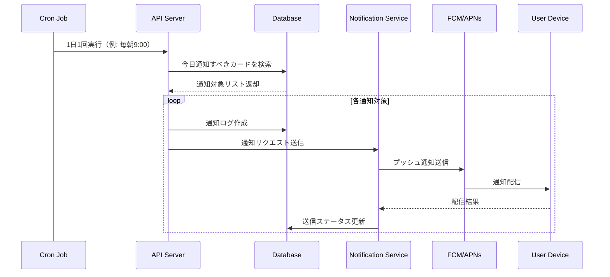

# 通知システム設計書：在留資格更新リマインダー

**作成日**: 2026年2月14日
**バージョン**: 1.0

---

## 1. 概要

### 1.1 通知システムの目的

在留資格の有効期限に基づき、適切なタイミングでユーザーに更新手続きのリマインダー通知を送信するシステム。

### 1.2 通知タイミング

| 通知タイプ | タイミング | 目的 |
|-----------|----------|------|
| 4ヶ月前通知 | 有効期限の4ヶ月前 | 申請可能時期の開始を通知 |
| 3ヶ月前通知 | 有効期限の3ヶ月前 | 書類準備の確認 |
| 1ヶ月前通知 | 有効期限の1ヶ月前 | 申請忘れ防止（最終確認） |
| 2週間前通知 | 有効期限の2週間前 | 緊急アラート |

### 1.3 技術スタック

- **iOS**: Apple Push Notification service (APNs)
- **Android**: Firebase Cloud Messaging (FCM)
- **スケジューラー**: Cron Jobs / Cloud Scheduler
- **バックエンド**: Node.js / Python / Go

---

## 2. システムアーキテクチャ

### 2.1 全体構成図

```
┌─────────────────┐
│  Mobile App     │
│  (iOS/Android)  │
└────────┬────────┘
         │ デバイストークン登録
         ↓
┌─────────────────┐
│  API Server     │ ← Cron Job (Daily Check)
│  - ユーザー管理  │
│  - 通知スケジュール│
└────────┬────────┘
         │
         ↓
┌─────────────────┐
│  Database       │
│  - residence_cards│
│  - notification_logs│
│  - device_tokens │
└─────────────────┘
         ↑
         │ 通知対象取得
         │
┌─────────────────┐
│  Notification   │
│  Service        │
│  - FCM/APNs送信 │
│  - リトライ処理  │
└─────────────────┘
```

### 2.2 通知フロー



---

## 3. Firebase Cloud Messaging (FCM) 統合

### 3.1 FCMプロジェクト設定

1. **Firebase Console でプロジェクト作成**
   - https://console.firebase.google.com/
   - プロジェクト名: `visa-reminder-app`

2. **Android アプリ追加**
   - パッケージ名: `com.visareminder.app`
   - `google-services.json` ダウンロード

3. **iOS アプリ追加**
   - Bundle ID: `com.visareminder.app`
   - `GoogleService-Info.plist` ダウンロード
   - APNs 認証キー（.p8）アップロード

### 3.2 FCM サーバーキー取得

```bash
# Firebase Admin SDK 秘密鍵のダウンロード
# Firebase Console > プロジェクト設定 > サービスアカウント
# 「新しい秘密鍵の生成」をクリック
# visa-reminder-firebase-adminsdk.json を保存
```

### 3.3 Node.js での FCM 統合

**依存関係インストール**:
```bash
npm install firebase-admin
```

**初期化コード**:
```javascript
// fcm-service.js
const admin = require('firebase-admin');
const serviceAccount = require('./visa-reminder-firebase-adminsdk.json');

admin.initializeApp({
  credential: admin.credential.cert(serviceAccount),
});

const messaging = admin.messaging();

/**
 * FCM 通知送信
 * @param {string} deviceToken - デバイストークン
 * @param {object} notification - 通知内容
 * @param {object} data - データペイロード
 */
async function sendNotification(deviceToken, notification, data = {}) {
  const message = {
    token: deviceToken,
    notification: {
      title: notification.title,
      body: notification.body,
    },
    data: data,
    android: {
      priority: 'high',
      notification: {
        sound: 'default',
        channelId: 'visa_reminder_channel',
      },
    },
    apns: {
      payload: {
        aps: {
          sound: 'default',
          badge: 1,
          contentAvailable: true,
        },
      },
    },
  };

  try {
    const response = await messaging.send(message);
    console.log('通知送信成功:', response);
    return { success: true, messageId: response };
  } catch (error) {
    console.error('通知送信失敗:', error);
    return { success: false, error: error.message };
  }
}

/**
 * マルチキャスト送信（複数デバイスへ一括送信）
 */
async function sendMulticastNotification(deviceTokens, notification, data = {}) {
  const message = {
    tokens: deviceTokens,
    notification: {
      title: notification.title,
      body: notification.body,
    },
    data: data,
  };

  try {
    const response = await messaging.sendMulticast(message);
    console.log('成功件数:', response.successCount);
    console.log('失敗件数:', response.failureCount);

    // 無効なトークンの処理
    if (response.failureCount > 0) {
      const failedTokens = [];
      response.responses.forEach((resp, idx) => {
        if (!resp.success) {
          failedTokens.push(deviceTokens[idx]);
          console.error('失敗トークン:', deviceTokens[idx], resp.error);
        }
      });
      // 無効なトークンをDBから削除
      await removeInvalidTokens(failedTokens);
    }

    return response;
  } catch (error) {
    console.error('マルチキャスト送信失敗:', error);
    throw error;
  }
}

module.exports = {
  sendNotification,
  sendMulticastNotification,
};
```

### 3.4 Python での FCM 統合

**依存関係インストール**:
```bash
pip install firebase-admin
```

**実装コード**:
```python
# fcm_service.py
import firebase_admin
from firebase_admin import credentials, messaging

# Firebase Admin SDK 初期化
cred = credentials.Certificate('visa-reminder-firebase-adminsdk.json')
firebase_admin.initialize_app(cred)

def send_notification(device_token: str, title: str, body: str, data: dict = None) -> dict:
    """
    FCM 通知送信
    """
    message = messaging.Message(
        token=device_token,
        notification=messaging.Notification(
            title=title,
            body=body,
        ),
        data=data or {},
        android=messaging.AndroidConfig(
            priority='high',
            notification=messaging.AndroidNotification(
                sound='default',
                channel_id='visa_reminder_channel',
            ),
        ),
        apns=messaging.APNSConfig(
            payload=messaging.APNSPayload(
                aps=messaging.Aps(
                    sound='default',
                    badge=1,
                    content_available=True,
                ),
            ),
        ),
    )

    try:
        response = messaging.send(message)
        print(f'通知送信成功: {response}')
        return {'success': True, 'message_id': response}
    except Exception as e:
        print(f'通知送信失敗: {e}')
        return {'success': False, 'error': str(e)}

def send_multicast(device_tokens: list, title: str, body: str, data: dict = None) -> dict:
    """
    マルチキャスト送信
    """
    message = messaging.MulticastMessage(
        tokens=device_tokens,
        notification=messaging.Notification(
            title=title,
            body=body,
        ),
        data=data or {},
    )

    try:
        response = messaging.send_multicast(message)
        print(f'成功: {response.success_count}, 失敗: {response.failure_count}')

        # 失敗したトークンの処理
        if response.failure_count > 0:
            failed_tokens = []
            for idx, resp in enumerate(response.responses):
                if not resp.success:
                    failed_tokens.append(device_tokens[idx])
                    print(f'失敗トークン: {device_tokens[idx]}, エラー: {resp.exception}')
            # 無効なトークンをDBから削除
            remove_invalid_tokens(failed_tokens)

        return {
            'success_count': response.success_count,
            'failure_count': response.failure_count,
        }
    except Exception as e:
        print(f'マルチキャスト送信失敗: {e}')
        raise e
```

---

## 4. Apple Push Notification service (APNs) 統合

### 4.1 APNs 認証設定

**認証方式**: トークンベース認証（推奨）

1. **Apple Developer Account でキー作成**
   - https://developer.apple.com/account/
   - Certificates, Identifiers & Profiles > Keys
   - 「+」ボタンでキー作成
   - Apple Push Notifications service (APNs) を有効化
   - `.p8` ファイルダウンロード

2. **キー情報の記録**
   - Key ID: `ABC123DEF4`
   - Team ID: `XYZ987654`
   - Bundle ID: `com.visareminder.app`

3. **Firebase Console へアップロード**
   - Firebase Console > プロジェクト設定 > Cloud Messaging
   - APNs 認証キーをアップロード

### 4.2 iOS アプリ側の実装

**SwiftUI サンプル**:
```swift
// AppDelegate.swift
import UIKit
import Firebase
import UserNotifications

@main
class AppDelegate: UIResponder, UIApplicationDelegate, UNUserNotificationCenterDelegate {

    func application(_ application: UIApplication,
                     didFinishLaunchingWithOptions launchOptions: [UIApplication.LaunchOptionsKey: Any]?) -> Bool {

        // Firebase 初期化
        FirebaseApp.configure()

        // 通知許可リクエスト
        UNUserNotificationCenter.current().delegate = self
        let authOptions: UNAuthorizationOptions = [.alert, .badge, .sound]
        UNUserNotificationCenter.current().requestAuthorization(
            options: authOptions,
            completionHandler: { granted, error in
                if granted {
                    print("通知許可取得")
                }
            }
        )

        application.registerForRemoteNotifications()

        return true
    }

    // デバイストークン取得成功
    func application(_ application: UIApplication,
                     didRegisterForRemoteNotificationsWithDeviceToken deviceToken: Data) {
        Messaging.messaging().apnsToken = deviceToken

        // FCM トークン取得
        Messaging.messaging().token { token, error in
            if let error = error {
                print("FCM トークン取得失敗: \(error)")
            } else if let token = token {
                print("FCM トークン: \(token)")
                // サーバーに送信
                self.sendTokenToServer(token)
            }
        }
    }

    // 通知受信（フォアグラウンド）
    func userNotificationCenter(_ center: UNUserNotificationCenter,
                                willPresent notification: UNNotification,
                                withCompletionHandler completionHandler: @escaping (UNNotificationPresentationOptions) -> Void) {
        let userInfo = notification.request.content.userInfo
        print("フォアグラウンド通知: \(userInfo)")

        completionHandler([[.banner, .badge, .sound]])
    }

    // 通知タップ時
    func userNotificationCenter(_ center: UNUserNotificationCenter,
                                didReceive response: UNNotificationResponse,
                                withCompletionHandler completionHandler: @escaping () -> Void) {
        let userInfo = response.notification.request.content.userInfo

        // データから遷移先を判定
        if let residenceCardId = userInfo["residence_card_id"] as? String {
            // 該当の在留カード詳細画面に遷移
            navigateToResidenceCardDetail(cardId: residenceCardId)
        }

        completionHandler()
    }

    func sendTokenToServer(_ token: String) {
        // API サーバーにトークンを送信
        let url = URL(string: "https://api.visa-reminder.app/v1/devices/register")!
        var request = URLRequest(url: url)
        request.httpMethod = "POST"
        request.setValue("application/json", forHTTPHeaderField: "Content-Type")

        let body: [String: Any] = [
            "device_token": token,
            "platform": "ios",
            "device_id": UIDevice.current.identifierForVendor?.uuidString ?? ""
        ]
        request.httpBody = try? JSONSerialization.data(withJSONObject: body)

        URLSession.shared.dataTask(with: request) { data, response, error in
            if let error = error {
                print("トークン送信失敗: \(error)")
            } else {
                print("トークン送信成功")
            }
        }.resume()
    }
}
```

---

## 5. 通知スケジューリングシステム

### 5.1 スケジューリング方式

**方式A: ローカル通知（MVP推奨）**
- アプリ内でローカル通知をスケジュール
- サーバー不要
- オフライン対応可能

**方式B: サーバーサイド通知（将来拡張）**
- サーバー側で定期的にチェック
- クラウド同期対応
- より柔軟な制御

### 5.2 ローカル通知実装（iOS）

```swift
// NotificationManager.swift
import UserNotifications

class NotificationManager {

    static let shared = NotificationManager()

    /// 在留カードの通知をスケジュール
    func scheduleReminders(for card: ResidenceCard) {
        // 既存の通知を削除
        cancelReminders(for: card.id)

        let expiryDate = card.expiryDate
        let settings = ReminderSettings.shared

        // 4ヶ月前通知
        if settings.notify4Months {
            scheduleNotification(
                identifier: "\(card.id)-4months",
                date: expiryDate.addingMonths(-4),
                title: "在留資格更新の準備を始めましょう",
                body: "申請可能時期が近づいています。必要書類をチェックしましょう。",
                data: ["residence_card_id": card.id, "type": "4months"]
            )
        }

        // 3ヶ月前通知
        if settings.notify3Months {
            scheduleNotification(
                identifier: "\(card.id)-3months",
                date: expiryDate.addingMonths(-3),
                title: "在留資格更新の書類準備",
                body: "必要書類の準備状況を確認してください。",
                data: ["residence_card_id": card.id, "type": "3months"]
            )
        }

        // 1ヶ月前通知
        if settings.notify1Month {
            scheduleNotification(
                identifier: "\(card.id)-1month",
                date: expiryDate.addingMonths(-1),
                title: "在留資格の有効期限まで1ヶ月",
                body: "まだ申請していない場合は、早めに手続きしてください。",
                data: ["residence_card_id": card.id, "type": "1month"]
            )
        }

        // 2週間前通知
        if settings.notify2Weeks {
            scheduleNotification(
                identifier: "\(card.id)-2weeks",
                date: expiryDate.addingDays(-14),
                title: "【緊急】在留資格の有効期限まで2週間",
                body: "至急、更新手続きを行ってください。",
                data: ["residence_card_id": card.id, "type": "2weeks"]
            )
        }
    }

    /// 通知スケジュール
    private func scheduleNotification(identifier: String, date: Date, title: String, body: String, data: [String: String]) {
        let content = UNMutableNotificationContent()
        content.title = title
        content.body = body
        content.sound = .default
        content.badge = 1
        content.userInfo = data

        let calendar = Calendar.current
        let components = calendar.dateComponents([.year, .month, .day, .hour, .minute], from: date)
        let trigger = UNCalendarNotificationTrigger(dateMatching: components, repeats: false)

        let request = UNNotificationRequest(identifier: identifier, content: content, trigger: trigger)

        UNUserNotificationCenter.current().add(request) { error in
            if let error = error {
                print("通知スケジュール失敗: \(error)")
            } else {
                print("通知スケジュール成功: \(identifier) at \(date)")
            }
        }
    }

    /// 特定カードの通知をキャンセル
    func cancelReminders(for cardId: String) {
        let identifiers = [
            "\(cardId)-4months",
            "\(cardId)-3months",
            "\(cardId)-1month",
            "\(cardId)-2weeks"
        ]
        UNUserNotificationCenter.current().removePendingNotificationRequests(withIdentifiers: identifiers)
    }
}

// Date 拡張
extension Date {
    func addingMonths(_ months: Int) -> Date {
        return Calendar.current.date(byAdding: .month, value: months, to: self) ?? self
    }

    func addingDays(_ days: Int) -> Date {
        return Calendar.current.date(byAdding: .day, value: days, to: self) ?? self
    }
}
```

### 5.3 サーバーサイド通知スケジューラー（Node.js）

```javascript
// notification-scheduler.js
const { sendNotification } = require('./fcm-service');
const db = require('./database');

/**
 * 毎日実行される通知チェックジョブ
 */
async function checkAndSendNotifications() {
  console.log('通知チェック開始:', new Date());

  try {
    // 今日通知すべきカードを取得
    const today = new Date().toISOString().split('T')[0];
    const notificationsToSend = await db.query(`
      SELECT
        nl.id as notification_id,
        nl.notification_type,
        rc.id as residence_card_id,
        rc.expiry_date,
        rt.name_ja as residence_type_name,
        u.id as user_id,
        dt.device_token,
        dt.platform
      FROM notification_logs nl
      INNER JOIN residence_cards rc ON nl.residence_card_id = rc.id
      INNER JOIN residence_types rt ON rc.residence_type_id = rt.id
      INNER JOIN users u ON rc.user_id = u.id
      INNER JOIN device_tokens dt ON u.id = dt.user_id
      WHERE nl.scheduled_date = ?
        AND nl.is_sent = 0
        AND nl.status = 'scheduled'
        AND rc.is_active = 1
        AND rc.deleted_at IS NULL
    `, [today]);

    console.log(`通知対象: ${notificationsToSend.length}件`);

    for (const notif of notificationsToSend) {
      await processNotification(notif);
    }

    console.log('通知チェック完了');
  } catch (error) {
    console.error('通知チェックエラー:', error);
  }
}

/**
 * 個別通知の処理
 */
async function processNotification(notif) {
  try {
    // 通知メッセージの生成
    const message = generateNotificationMessage(notif);

    // FCM/APNs 経由で送信
    const result = await sendNotification(
      notif.device_token,
      {
        title: message.title,
        body: message.body,
      },
      {
        residence_card_id: notif.residence_card_id,
        notification_type: notif.notification_type,
      }
    );

    // 送信結果を記録
    if (result.success) {
      await db.query(`
        UPDATE notification_logs
        SET is_sent = 1, sent_at = NOW(), status = 'sent'
        WHERE id = ?
      `, [notif.notification_id]);
      console.log(`通知送信成功: ${notif.notification_id}`);
    } else {
      await db.query(`
        UPDATE notification_logs
        SET status = 'failed', error_message = ?
        WHERE id = ?
      `, [result.error, notif.notification_id]);
      console.error(`通知送信失敗: ${notif.notification_id}`, result.error);
    }
  } catch (error) {
    console.error('通知処理エラー:', error);
    await db.query(`
      UPDATE notification_logs
      SET status = 'failed', error_message = ?
      WHERE id = ?
    `, [error.message, notif.notification_id]);
  }
}

/**
 * 通知メッセージの生成
 */
function generateNotificationMessage(notif) {
  const messages = {
    '4months': {
      title: '在留資格更新の準備を始めましょう',
      body: `${notif.residence_type_name}の申請可能時期が近づいています。必要書類をチェックしましょう。`,
    },
    '3months': {
      title: '在留資格更新の書類準備',
      body: `有効期限まで3ヶ月です。必要書類の準備状況を確認してください。`,
    },
    '1month': {
      title: '在留資格の有効期限まで1ヶ月',
      body: 'まだ申請していない場合は、早めに手続きしてください。',
    },
    '2weeks': {
      title: '【緊急】在留資格の有効期限まで2週間',
      body: '至急、更新手続きを行ってください。',
    },
  };

  return messages[notif.notification_type] || {
    title: '在留資格更新リマインダー',
    body: '有効期限をご確認ください。',
  };
}

/**
 * 在留カード登録時の通知スケジュール作成
 */
async function createNotificationSchedule(residenceCardId, expiryDate, userId) {
  // ユーザーのリマインダー設定を取得
  const settings = await db.query(`
    SELECT * FROM reminder_settings WHERE user_id = ?
  `, [userId]);

  if (!settings || !settings.enabled) {
    console.log('リマインダー無効化されているためスキップ');
    return;
  }

  const notifications = [];

  // 4ヶ月前通知
  if (settings.notify_4months) {
    notifications.push({
      residence_card_id: residenceCardId,
      notification_type: '4months',
      scheduled_date: addMonths(expiryDate, -4),
    });
  }

  // 3ヶ月前通知
  if (settings.notify_3months) {
    notifications.push({
      residence_card_id: residenceCardId,
      notification_type: '3months',
      scheduled_date: addMonths(expiryDate, -3),
    });
  }

  // 1ヶ月前通知
  if (settings.notify_1month) {
    notifications.push({
      residence_card_id: residenceCardId,
      notification_type: '1month',
      scheduled_date: addMonths(expiryDate, -1),
    });
  }

  // 2週間前通知
  if (settings.notify_2weeks) {
    notifications.push({
      residence_card_id: residenceCardId,
      notification_type: '2weeks',
      scheduled_date: addDays(expiryDate, -14),
    });
  }

  // notification_logs に挿入
  for (const notif of notifications) {
    await db.query(`
      INSERT INTO notification_logs
        (id, residence_card_id, notification_type, scheduled_date, status, created_at)
      VALUES (UUID(), ?, ?, ?, 'scheduled', NOW())
    `, [notif.residence_card_id, notif.notification_type, notif.scheduled_date]);
  }

  console.log(`通知スケジュール作成: ${notifications.length}件`);
}

/**
 * 日付計算ヘルパー
 */
function addMonths(date, months) {
  const d = new Date(date);
  d.setMonth(d.getMonth() + months);
  return d.toISOString().split('T')[0];
}

function addDays(date, days) {
  const d = new Date(date);
  d.setDate(d.getDate() + days);
  return d.toISOString().split('T')[0];
}

module.exports = {
  checkAndSendNotifications,
  createNotificationSchedule,
};
```

### 5.4 Cron Job 設定

**Node-Cron を使用した定期実行**:
```javascript
// cron-jobs.js
const cron = require('node-cron');
const { checkAndSendNotifications } = require('./notification-scheduler');

// 毎日午前9時に実行（日本時間）
cron.schedule('0 9 * * *', async () => {
  console.log('通知チェックジョブ開始');
  await checkAndSendNotifications();
}, {
  timezone: 'Asia/Tokyo'
});

console.log('Cron Job セットアップ完了');
```

**システムCron（Linux）**:
```cron
# /etc/cron.d/visa-reminder
0 9 * * * node /path/to/notification-scheduler.js >> /var/log/visa-reminder/cron.log 2>&1
```

**Cloud Scheduler（GCP）**:
```yaml
# cloud-scheduler.yaml
- name: notification-check
  schedule: "0 9 * * *"
  timeZone: "Asia/Tokyo"
  httpTarget:
    uri: "https://api.visa-reminder.app/v1/admin/notifications/check"
    httpMethod: POST
    headers:
      Authorization: "Bearer ${ADMIN_API_KEY}"
```

---

## 6. デバイストークン管理

### 6.1 device_tokens テーブル

```sql
CREATE TABLE device_tokens (
    id VARCHAR(36) PRIMARY KEY,
    user_id VARCHAR(36) NOT NULL,
    device_token TEXT NOT NULL,
    platform VARCHAR(10) NOT NULL, -- 'ios' or 'android'
    device_id VARCHAR(255),
    is_active BOOLEAN NOT NULL DEFAULT TRUE,
    created_at TIMESTAMP NOT NULL DEFAULT CURRENT_TIMESTAMP,
    updated_at TIMESTAMP NOT NULL DEFAULT CURRENT_TIMESTAMP,
    last_used_at TIMESTAMP,
    FOREIGN KEY (user_id) REFERENCES users(id) ON DELETE CASCADE,
    UNIQUE KEY idx_device_token (device_token(255))
);

CREATE INDEX idx_device_tokens_user ON device_tokens(user_id, is_active);
CREATE INDEX idx_device_tokens_platform ON device_tokens(platform);
```

### 6.2 トークン登録API

```javascript
// routes/devices.js
router.post('/register', async (req, res) => {
  const { device_token, platform, device_id } = req.body;
  const userId = req.user.id; // JWT から取得

  try {
    // 既存トークンをチェック
    const existing = await db.query(`
      SELECT id FROM device_tokens WHERE device_token = ?
    `, [device_token]);

    if (existing) {
      // 更新
      await db.query(`
        UPDATE device_tokens
        SET user_id = ?, last_used_at = NOW(), updated_at = NOW()
        WHERE device_token = ?
      `, [userId, device_token]);
    } else {
      // 新規登録
      await db.query(`
        INSERT INTO device_tokens (id, user_id, device_token, platform, device_id, created_at, updated_at)
        VALUES (UUID(), ?, ?, ?, ?, NOW(), NOW())
      `, [userId, device_token, platform, device_id]);
    }

    res.status(200).json({ success: true });
  } catch (error) {
    console.error('トークン登録エラー:', error);
    res.status(500).json({ error: 'トークン登録に失敗しました' });
  }
});
```

### 6.3 無効トークンの削除

```javascript
async function removeInvalidTokens(tokens) {
  if (tokens.length === 0) return;

  await db.query(`
    UPDATE device_tokens
    SET is_active = 0, updated_at = NOW()
    WHERE device_token IN (?)
  `, [tokens]);

  console.log(`無効トークン削除: ${tokens.length}件`);
}
```

---

## 7. 通知内容のローカライゼーション

### 7.1 多言語対応メッセージ

```javascript
// locales/notifications.js
const messages = {
  ja: {
    '4months': {
      title: '在留資格更新の準備を始めましょう',
      body: '{residence_type}の申請可能時期が近づいています。必要書類をチェックしましょう。',
    },
    '3months': {
      title: '在留資格更新の書類準備',
      body: '有効期限まで3ヶ月です。必要書類の準備状況を確認してください。',
    },
    '1month': {
      title: '在留資格の有効期限まで1ヶ月',
      body: 'まだ申請していない場合は、早めに手続きしてください。',
    },
    '2weeks': {
      title: '【緊急】在留資格の有効期限まで2週間',
      body: '至急、更新手続きを行ってください。',
    },
  },
  en: {
    '4months': {
      title: 'Start Preparing for Visa Renewal',
      body: 'Application period for {residence_type} is approaching. Check required documents.',
    },
    '3months': {
      title: 'Visa Renewal Document Preparation',
      body: '3 months until expiry. Please check your document preparation status.',
    },
    '1month': {
      title: '1 Month Until Visa Expiration',
      body: 'If you haven\'t applied yet, please proceed soon.',
    },
    '2weeks': {
      title: '[URGENT] 2 Weeks Until Visa Expiration',
      body: 'Please renew your visa immediately.',
    },
  },
  vi: {
    '4months': {
      title: 'Bắt đầu chuẩn bị gia hạn visa',
      body: 'Thời gian nộp đơn cho {residence_type} đang đến gần. Kiểm tra các tài liệu cần thiết.',
    },
    // ... 他のメッセージ
  },
};

function getNotificationMessage(locale, type, params = {}) {
  const template = messages[locale]?.[type] || messages['ja'][type];
  return {
    title: template.title,
    body: template.body.replace(/{(\w+)}/g, (match, key) => params[key] || match),
  };
}

module.exports = { getNotificationMessage };
```

---

## 8. リトライ・エラーハンドリング

### 8.1 リトライロジック

```javascript
async function sendNotificationWithRetry(deviceToken, notification, data, maxRetries = 3) {
  let lastError;

  for (let attempt = 1; attempt <= maxRetries; attempt++) {
    try {
      const result = await sendNotification(deviceToken, notification, data);
      if (result.success) {
        return result;
      }
      lastError = result.error;
    } catch (error) {
      lastError = error;
      console.error(`送信失敗 (試行 ${attempt}/${maxRetries}):`, error);
    }

    // 指数バックオフ
    if (attempt < maxRetries) {
      const delay = Math.pow(2, attempt) * 1000; // 2秒, 4秒, 8秒...
      await sleep(delay);
    }
  }

  throw new Error(`最大リトライ回数を超過: ${lastError}`);
}

function sleep(ms) {
  return new Promise(resolve => setTimeout(resolve, ms));
}
```

### 8.2 エラー分類と対応

| エラータイプ | 原因 | 対応 |
|------------|------|------|
| `messaging/invalid-registration-token` | 無効なトークン | DBから削除 |
| `messaging/registration-token-not-registered` | 未登録トークン | DBから削除 |
| `messaging/message-rate-exceeded` | レート制限超過 | 待機後リトライ |
| `messaging/server-unavailable` | サーバー障害 | リトライ |
| `messaging/internal-error` | 内部エラー | ログ記録・リトライ |

---

## 9. テスト・デバッグ

### 9.1 テスト通知送信

```javascript
// test-notification.js
const { sendNotification } = require('./fcm-service');

async function sendTestNotification() {
  const testToken = 'YOUR_DEVICE_TOKEN_HERE';

  const result = await sendNotification(
    testToken,
    {
      title: 'テスト通知',
      body: 'これはテスト通知です。',
    },
    {
      test: 'true',
    }
  );

  console.log('結果:', result);
}

sendTestNotification();
```

### 9.2 FCMコンソールでのテスト

1. Firebase Console > Cloud Messaging
2. 「新しい通知」ボタンをクリック
3. 通知タイトル・本文を入力
4. 「テストメッセージを送信」
5. FCMトークンを入力してテスト

---

## 10. モニタリング・ログ

### 10.1 通知送信ログ

```javascript
// logger.js
const winston = require('winston');

const logger = winston.createLogger({
  level: 'info',
  format: winston.format.json(),
  transports: [
    new winston.transports.File({ filename: 'logs/notification-error.log', level: 'error' }),
    new winston.transports.File({ filename: 'logs/notification.log' }),
  ],
});

// 通知送信ログ
logger.info('通知送信', {
  notification_id: 'notif-123',
  user_id: 'user-456',
  notification_type: '4months',
  status: 'sent',
  timestamp: new Date().toISOString(),
});
```

### 10.2 メトリクス収集

```javascript
// metrics.js
const metrics = {
  total_sent: 0,
  total_failed: 0,
  total_invalid_tokens: 0,
};

function incrementMetric(name) {
  metrics[name] = (metrics[name] || 0) + 1;
}

function getMetrics() {
  return metrics;
}

// Prometheus エクスポート
const promClient = require('prom-client');
const sentCounter = new promClient.Counter({
  name: 'notifications_sent_total',
  help: '送信した通知の総数',
});
```

---

## 11. セキュリティ考慮事項

### 11.1 秘密鍵の管理

- Firebase Admin SDK の秘密鍵は環境変数で管理
- Git にコミットしない（.gitignore に追加）
- 本番環境では Secret Manager を使用

```bash
# 環境変数設定
export FIREBASE_SERVICE_ACCOUNT_KEY=$(cat visa-reminder-firebase-adminsdk.json)
```

### 11.2 通知内容の検証

- ユーザー入力を通知に含める場合はサニタイズ
- XSS 対策（エスケープ処理）
- 個人情報の最小化

---

## 12. パフォーマンス最適化

### 12.1 バッチ処理

```javascript
// 100件ずつバッチ送信
async function sendNotificationsInBatches(notifications, batchSize = 100) {
  for (let i = 0; i < notifications.length; i += batchSize) {
    const batch = notifications.slice(i, i + batchSize);
    const tokens = batch.map(n => n.device_token);
    const notification = { title: '...', body: '...' };

    await sendMulticastNotification(tokens, notification);
    await sleep(1000); // レート制限対策
  }
}
```

### 12.2 キューイングシステム（将来拡張）

- **Redis + Bull Queue** の使用
- 非同期処理によるスループット向上

```javascript
const Queue = require('bull');
const notificationQueue = new Queue('notifications', {
  redis: { host: 'localhost', port: 6379 },
});

notificationQueue.process(async (job) => {
  const { deviceToken, notification, data } = job.data;
  await sendNotification(deviceToken, notification, data);
});
```

---

## 13. 改訂履歴

| 版 | 日付 | 変更内容 |
|----|------|----------|
| 1.0 | 2026-02-14 | 初版作成 |

---

**レビュー承認**: _______________
**次回レビュー予定**: 2026-03-14
