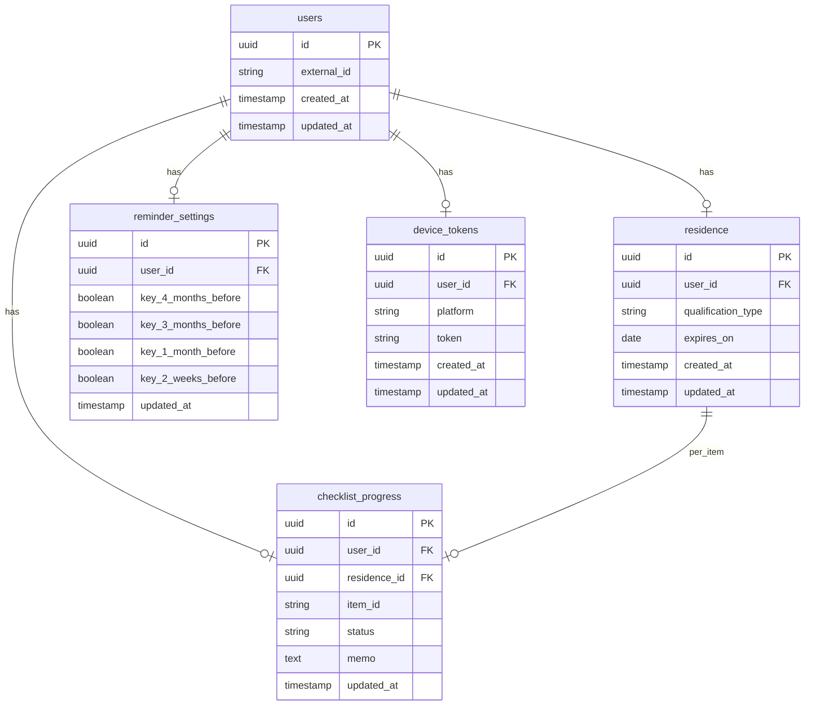

# DB設計書：在留資格更新リマインダー

**文書バージョン**: 1.0  
**作成日**: 2025年2月14日  
**参照**: [共通データ契約.md](共通データ契約.md)、[要件定義書.md](../要件定義書.md)

---

## 1. 概要

- **クライアント側**: アプリ内のローカル保存（SQLite / Realm / AsyncStorage 等を想定）。オフラインでの閲覧・編集を可能にする。
- **サーバー側**: アカウント連携・同期を想定した将来用。個人を特定するデータは保存しない（要件 6.2）。
- **マスタ**: 資格タイプ・チェックリストテンプレートはアプリ内に静的データとして保持するか、初回DLで取得。コード・ID は [共通データ契約.md](共通データ契約.md) と完全一致。

---

## 2. クライアント側（ローカル）エンティティ

### 2.1 在留資格登録（residence）

1ユーザー（1端末）あたり MVP では1件。

| カラム名 | 型 | 必須 | 説明 |
|----------|-----|------|------|
| id | string (UUID 等) | ○ | ローカル一意識別子 |
| qualification_type | string | ○ | 資格タイプコード（共通契約の code: work / spouse / permanent_prep / other） |
| expires_on | string (YYYY-MM-DD) | ○ | 在留カードの有効期限 |
| created_at | string (ISO 8601) | ○ | 登録日時 |
| updated_at | string (ISO 8601) | ○ | 更新日時 |

- **備考**: 氏名・在留カード番号等は持たない。

### 2.2 リマインダー設定（reminder_settings）

各リマインダーキーごとの ON/OFF。1端末あたり1件（在留資格が1件のため）。

| カラム名 | 型 | 必須 | 説明 |
|----------|-----|------|------|
| id | string | ○ | ローカル一意識別子 |
| 4_months_before | boolean | ○ | 4ヶ月前に通知するか（デフォルト true） |
| 3_months_before | boolean | ○ | 3ヶ月前に通知するか |
| 1_month_before | boolean | ○ | 1ヶ月前に通知するか |
| 2_weeks_before | boolean | ○ | 2週間前に通知するか |
| updated_at | string (ISO 8601) | ○ | 更新日時 |

- **キー名**: 共通契約のリマインダーキー（`4_months_before` 等）をそのままカラム名またはプロパティ名とする。

### 2.3 チェックリスト進捗（checklist_progress）

資格タイプに応じたテンプレートの各項目に対する状態。在留資格1件につき、対応するテンプレートの項目数分のレコードを持つ。

| カラム名 | 型 | 必須 | 説明 |
|----------|-----|------|------|
| id | string | ○ | ローカル一意識別子 |
| residence_id | string | ○ | 在留資格登録の id（FK） |
| item_id | string | ○ | チェック項目ID（共通契約の item_id: work_01, spouse_01 等） |
| status | string | ○ | 状態（not_started / done） |
| memo | string | - | メモ（任意） |
| updated_at | string (ISO 8601) | ○ | 更新日時 |

- **一意制約**: (residence_id, item_id) の組み合わせはユニーク。資格タイプが決まるとテンプレートの item_id 一覧が決まるため、residence 登録時に該当 item_id 分のレコードを初期化する。

### 2.4 資格タイプマスタ・チェックリストテンプレート（静的）

アプリ内に JSON またはコードで保持。共通データ契約の「資格タイプ一覧」「チェックリスト項目」をそのまま使用する。

- **qualification_types**: code, label_ja, i18n_key, application_guide（申請可能時期の目安文言）
- **checklist_templates**: qualification_type_code, item_id, label_ja, i18n_key, sort_order

（実装時は共通データ契約の表をそのままリソース化すればよい。）

---

## 3. サーバー側（将来用）テーブル設計

アカウント連携時にユーザー識別子のみで紐づけ、機微情報は保存しない。

### 3.1 users

| カラム名 | 型 | 必須 | 説明 |
|----------|-----|------|------|
| id | UUID | ○ | 主キー |
| external_id | string | ○ | 認証プロバイダの識別子（匿名化またはハッシュ化を推奨） |
| created_at | timestamp | ○ | 登録日時 |
| updated_at | timestamp | ○ | 更新日時 |

- メール・氏名等は持たない設計とする（認証はストアまたは匿名認証のみ想定する場合）。

### 3.2 residence（在留資格登録）

| カラム名 | 型 | 必須 | 説明 |
|----------|-----|------|------|
| id | UUID | ○ | 主キー |
| user_id | UUID | ○ | users.id（FK） |
| qualification_type | string | ○ | 共通契約の code |
| expires_on | date | ○ | 有効期限（YYYY-MM-DD） |
| created_at | timestamp | ○ | 登録日時 |
| updated_at | timestamp | ○ | 更新日時 |

### 3.3 reminder_settings（リマインダー設定）

| カラム名 | 型 | 必須 | 説明 |
|----------|-----|------|------|
| id | UUID | ○ | 主キー |
| user_id | UUID | ○ | users.id（FK） |
| key_4_months_before | boolean | ○ | 同上 |
| key_3_months_before | boolean | ○ | 同上 |
| key_1_month_before | boolean | ○ | 同上 |
| key_2_weeks_before | boolean | ○ | 同上 |
| updated_at | timestamp | ○ | 更新日時 |

- 1 user 1 件。キー名は共通契約に合わせる。

### 3.4 checklist_progress（チェックリスト進捗）

| カラム名 | 型 | 必須 | 説明 |
|----------|-----|------|------|
| id | UUID | ○ | 主キー |
| user_id | UUID | ○ | users.id（FK） |
| residence_id | UUID | ○ | residence.id（FK） |
| item_id | string | ○ | 共通契約の item_id |
| status | string | ○ | not_started / done |
| memo | text | - | メモ |
| updated_at | timestamp | ○ | 更新日時 |

- 一意制約: (user_id, residence_id, item_id)

### 3.5 device_tokens（プッシュ通知用・将来）

| カラム名 | 型 | 必須 | 説明 |
|----------|-----|------|------|
| id | UUID | ○ | 主キー |
| user_id | UUID | ○ | users.id（FK） |
| platform | string | ○ | ios / android |
| token | string | ○ | FCM/APNs トークン |
| created_at | timestamp | ○ | 登録日時 |
| updated_at | timestamp | ○ | 更新日時 |

### 3.6 マスタ（資格タイプ・チェックリストテンプレート）

サーバーで配信する場合は、共通契約と同一のコード・item_id を持つマスタテーブルまたは JSON を用意。  
API の `GET /master/qualification-types`, `GET /master/checklist-templates/:qualificationTypeId` で返す内容と一致させる。

---

## 4. ER 図（サーバー側・将来用）

---

## 5. API 設計との対応

- エンドポイント `GET/PUT /me/residence` のペイロードは `residence` エンティティのフィールドと一致。
- `GET/PUT /me/reminder-settings` は `reminder_settings` の各キーを JSON でやりとり。
- `GET/PUT /me/checklist-progress` は `checklist_progress` のリスト。item_id と status を共通契約のコードで統一。
- マスタ API のレスンスは、共通契約の資格タイプ一覧・チェックリスト項目一覧と同一の code / item_id を使用する。

---

## 改訂履歴

| 版 | 日付 | 変更内容 |
|----|------|----------|
| 1.0 | 2025-02-14 | 初版作成 |
