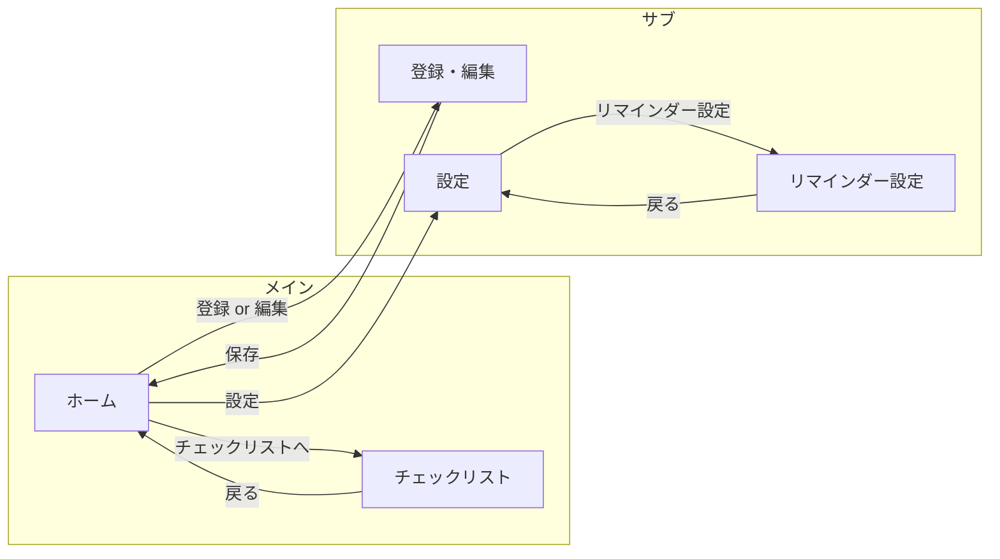

# UI設計書：在留資格更新リマインダー

**文書バージョン**: 1.0  
**作成日**: 2025年2月14日  
**参照**: [共通データ契約.md](共通データ契約.md)、[API設計書.md](API設計書.md)、[要件定義書.md](../要件定義書.md)

---

## 1. 画面一覧と遷移

要件定義書 5 の5画面を対象とする。

| 画面ID | 画面名 | 役割 |
|--------|--------|------|
| HOME | ホーム／一覧 | 有効期限・残り日数・次回リマインド日表示、チェックリストへのCTA。未登録時はオンボーディング |
| RESIDENCE_EDIT | 登録・編集 | 有効期限・資格タイプの入力・変更。申請可能時期の目安表示 |
| REMINDER_SETTINGS | リマインダー設定 | 4・3・1ヶ月前・2週間前のトグル、通知許可への導線 |
| CHECKLIST | チェックリスト | 資格タイプに応じた項目リスト、チェックON/OFF、メモ・外部リンク |
| SETTINGS | 設定 | 通知、利用規約・プライバシーポリシー、お問い合わせ（課金はMVPではラベルのみ可） |

### 画面遷移図

- 未登録時: ホーム表示時に「在留資格を登録する」CTA を前面にし、RESIDENCE_EDIT へ誘導。
- 登録済み: ホームにカード表示、チェックリスト・設定への導線を表示。

---

## 2. 画面別構成とデータ対応

### 2.1 ホーム（HOME）

**表示要素**

| 要素 | 内容 | データソース（API/ローカル） |
|------|------|-----------------------------|
| 有効期限 | 在留カードの有効期限（YYYY/MM/DD 等の表示形式） | residence.expires_on |
| 残り日数 | 「あと○日」または「○年○ヶ月」 | residence.expires_on から算出 |
| 資格タイプ表示 | 例「就労系（技術・人文・技能等）」 | residence.qualification_type → 共通契約のラベルまたは i18n_key |
| 次回リマインド日 | 次に通知が飛ぶ日付（該当するリマインダーキーに基づく日付） | residence.expires_on + reminder_settings の ON になっているキーから「次の日付」を算出 |
| 申請可能時期の目安 | 例「申請は○月○日頃から可能です」 | residence.expires_on（4ヶ月前の日付）＋資格タイプの application_guide |
| CTA「チェックリストを確認」 | チェックリスト画面へ | ナビゲーション |
| 編集ボタン | 登録・編集画面へ | ナビゲーション |
| 未登録時 | 「在留資格を登録しましょう」＋「登録する」ボタン | residence が null の場合 |

**状態**

- 未登録: オンボーディングブロック＋「登録する」CTA。
- 登録済み: 上記カード＋チェックリストへのショートカット。

**オフライン**: ローカルに保存済みの residence / reminder_settings で表示。編集・同期はオンライン復帰後に行う旨を必要に応じて表示（将来用）。

---

### 2.2 登録・編集（RESIDENCE_EDIT）

**表示・入力要素**

| 要素 | 内容 | データソース |
|------|------|--------------|
| 有効期限 | 日付ピッカー（年月日） | residence.expires_on。入力値は PUT /me/residence の expires_on |
| 資格タイプ | 単一選択（ラジオまたはドロップダウン） | 共通契約の資格タイプ一覧（label_ja または i18n_key で表示） |
| 申請可能時期の目安 | 選択中の資格タイプに応じた説明文 | 共通契約の application_guide ＋ expires_on から「○月○日頃から」を計算 |
| 保存 / キャンセル | ボタン | 保存時は PUT /me/residence またはローカル更新 |

**バリデーション**: 有効期限は必須。過去日は警告またはエラー表示（要件上は「今日以降」を許容）。

**データ対応**: 資格タイプの選択肢は共通データ契約の code とラベルを一致させる。API の GET /master/qualification-types またはローカルマスタと同一。

---

### 2.3 リマインダー設定（REMINDER_SETTINGS）

**表示・操作要素**

| 要素 | 内容 | データソース |
|------|------|--------------|
| 各リマインダー | 「4ヶ月前」「3ヶ月前」「1ヶ月前」「2週間前」のトグル（ON/OFF） | reminder_settings の各キー（4_months_before 等） |
| 表示文言 | 共通契約の「表示名（日本語）」または i18n_key | 共通データ契約のリマインダーキーとラベル |
| 通知許可への導線 | 「通知を有効にする」リンク／ボタン | 端末の通知設定画面へ遷移するか、アプリ内で許可ダイアログを促す |

**保存**: トグル変更時に PUT /me/reminder-settings またはローカル保存。MVP では固定タイミングのため「時刻」の設定は不要。

---

### 2.4 チェックリスト（CHECKLIST）

**表示・操作要素**

| 要素 | 内容 | データソース |
|------|------|--------------|
| 資格タイプに応じた項目一覧 | 項目ラベル＋チェックボックス（未着手/完了） | 共通契約のチェックリストテンプレート（item_id + label）。進捗は GET /me/checklist-progress またはローカル checklist_progress |
| 各項目の状態 | チェックON＝完了、OFF＝未着手 | checklist_progress.status（not_started / done） |
| メモ欄（任意） | 項目ごとのメモ | checklist_progress.memo |
| 外部リンク | 入管の申請案内ページ等 | 静的URL（例: 法務省入管HP）。画面下部または「詳しくはこちら」リンク |

**データ対応**: 表示する項目は residence.qualification_type に対応するテンプレート（work → work_01〜work_05 等）。item_id と status は API/DB と共通契約で一致させる。

**空状態**: 在留資格未登録の場合は「先に在留資格を登録してください」とホームまたは登録画面への導線。

---

### 2.5 設定（SETTINGS）

**表示・操作要素**

| 要素 | 内容 | 備考 |
|------|------|------|
| 通知 | 通知の ON/OFF または「リマインダー設定」へのリンク | リマインダー設定画面へ遷移 |
| 利用規約 | リンクまたは WebView | 外部URLまたはアプリ内表示 |
| プライバシーポリシー | 同上 | 同上 |
| お問い合わせ | メールまたはフォームへのリンク | 将来用 |
| 課金（任意） | 「プレミアム」等のラベルのみ | MVP では未実装でも項目として用意可 |

---

## 3. コンポーネント一覧

| コンポーネント | 用途 | 表示データ |
|----------------|------|------------|
| カード（有効期限） | ホームのメインカード | expires_on, 残り日数, 資格タイプ名, 次回リマインド日 |
| リスト行（チェックリスト項目） | チェックリスト画面の1行 | item の label, status（チェックON/OFF）, memo |
| 日付表示 | 有効期限・リマインド日の表示 | YYYY/MM/DD 等。共通でフォーマット方針を統一 |
| 空状態 | 未登録・データなし | メッセージ＋CTA（例「登録する」） |
| エラー表示 | バリデーションエラー・API エラー | message または error.message。共通データ契約外のデータは表示しない |
| 資格タイプ選択肢 | 登録・編集画面 | 共通契約の qualification_type の label_ja / i18n_key |
| リマインダートグル行 | リマインダー設定画面 | 共通契約のリマインダーキーとラベル |

**ラベル表示方針**: 資格タイプ・リマインダーキー・チェックリスト項目は、共通データ契約の「表示名（日本語）」をデフォルトとし、多言語対応時は i18n_key でリソースを参照する。

---

## 4. オフライン・同期（将来用）

- **オフライン時**: 登録済みの期限・チェックリストの閲覧・編集はローカルで可能とする。編集結果はローカルに保存し、オンライン復帰後にサーバーへ同期する設計を想定。
- **同期エラー表示**: 将来、同期が失敗した場合に「同期に失敗しました。後でもう一度お試しください」等のメッセージを表示する領域を用意する。MVP では未実装でもよい。
- **表示するデータ項目**: いずれも API レスンス／ローカル DB のフィールド（residence, reminder_settings, checklist_progress）と対応付けてあり、画面で必要なデータは API/DB で賄える。

---

## 5. 他領域との整合

- **API**: 画面で表示する項目は [API設計書.md](API設計書.md) の GET /me/residence, GET /me/reminder-settings, GET /me/checklist-progress および GET /master/* で取得可能。
- **共通契約**: 資格タイプ・リマインダーキー・チェック項目の表示文言は [共通データ契約.md](共通データ契約.md) のラベルまたは多言語キーと一致させる。
- **DB**: ローカル保存するエンティティ（residence, reminder_settings, checklist_progress）のフィールド名・コードは DB設計書および共通契約と同一。

---

## 改訂履歴

| 版 | 日付 | 変更内容 |
|----|------|----------|
| 1.0 | 2025-02-14 | 初版作成 |
